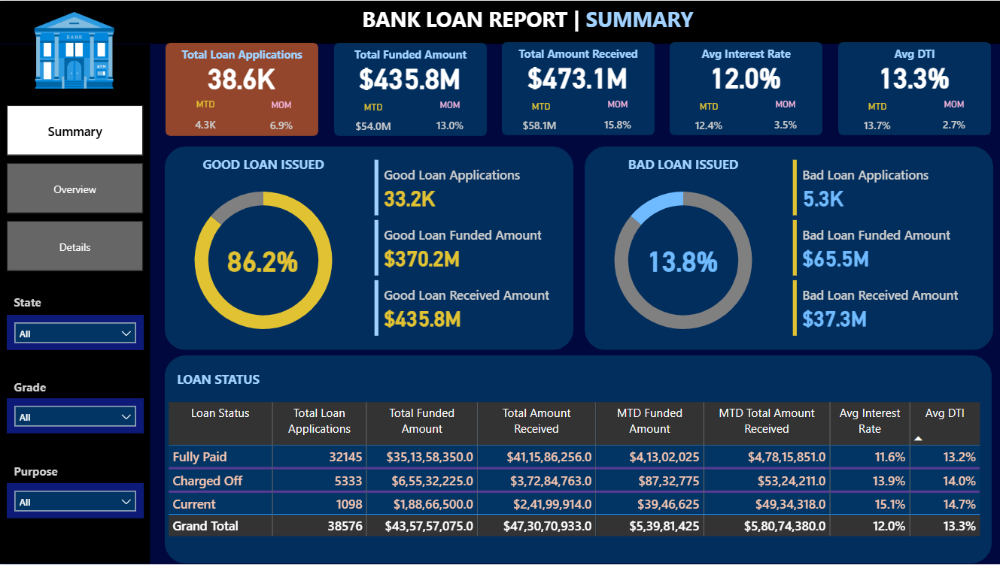
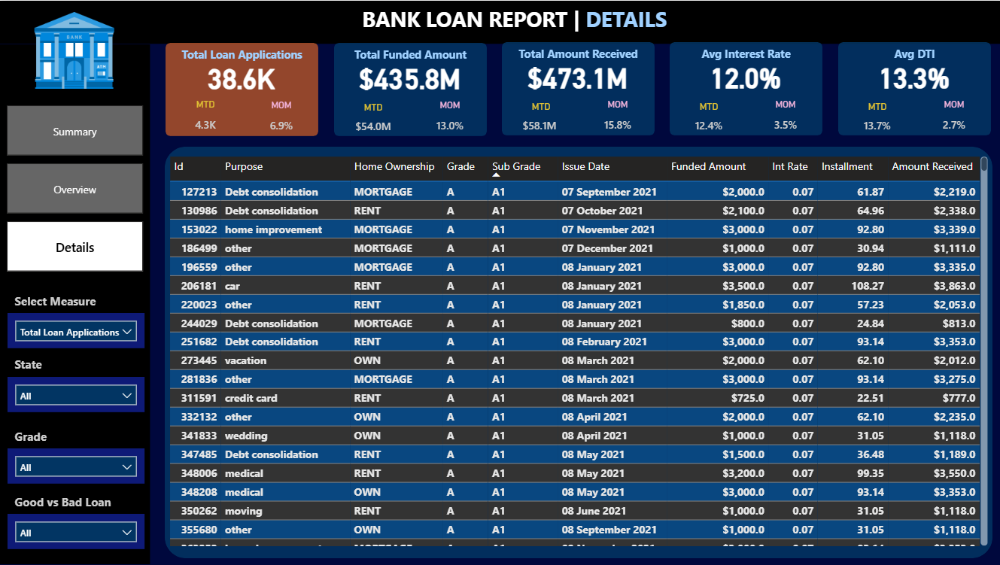
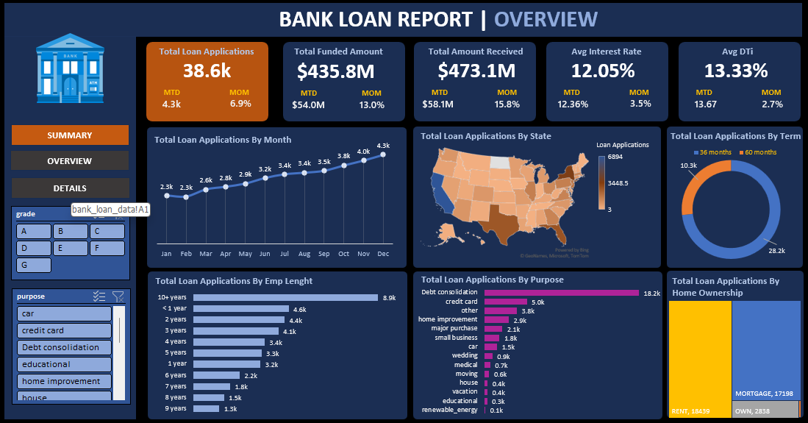

# 🏦 Bank Loan Performance Analysis

End-to-end analysis of **38,576 bank loan records** to track loan performance, quantify risk, and surface portfolio insights — built with **SQL, Power BI, Tableau, and Excel**.


---

## 📌 Overview

This project simulates a real-world **credit risk / loan performance reporting workflow** for a bank. Starting from raw loan-level data, I wrote SQL to calculate portfolio KPIs, then built three parallel dashboards (Power BI, Tableau, Excel) so stakeholders can monitor:

- Loan volume and funding trends over time
- Repayment behavior ("good" vs "bad" loans)
- Borrower demographics and risk segments
- State-wise and purpose-wise loan distribution

## 🎯 Objectives

- Analyze historical bank loan data to understand borrower behavior
- Identify loan performance and default/risk patterns
- Track month-to-date (MTD) vs previous-month-to-date (PMTD) KPI trends
- Build interactive, filterable dashboards for business decision-making
- Support credit and lending strategy with clear, visual reporting

## 📊 Key KPIs (from the dashboard)

| Metric | Value |
|---|---|
| Total Loan Applications | 38.6K |
| Total Funded Amount | $435.8M |
| Total Amount Received | $473.1M |
| Average Interest Rate | 12.0% |
| Average DTI (Debt-to-Income) | 13.3% |
| Good Loan Rate (Fully Paid / Current) | 86.2% |
| Bad Loan Rate (Charged Off) | 13.8% |

## 🖼️ Dashboard Previews

**Power BI — Summary**


**Power BI — Loan Details**


**Excel — Overview**


More screenshots (Tableau summary/overview/details, Excel summary) are available in [`assets/screenshots`](assets/screenshots).

## 🔍 Key Insights

- **86.2%** of loans are performing well (Fully Paid or Current), against **13.8%** charged off — a healthy but monitorable risk profile.
- **Debt consolidation** is by far the top loan purpose (18.2K applications), followed by credit card and "other."
- Borrowers with **10+ years employment** submit the most applications (8.9K), suggesting tenure correlates with loan uptake.
- Loan applications trend **upward month-over-month** across the year, from 2.3K in January to 4.3K in December.
- **Renters and mortgage holders** together account for the large majority of applications over outright homeowners.

## 🛠️ Tech Stack

| Tool | Purpose |
|---|---|
| **SQL** | KPI calculation, aggregation, and MTD/PMTD trend queries |
| **Power BI** | Interactive summary/overview/details dashboard with slicers |
| **Tableau** | Alternate dashboard implementation for cross-tool comparison |
| **Excel** | Pivot-based dashboard for lightweight, no-BI-tool reporting |

## 📁 Repository Structure

```
Bank-Loan-Performance-Analysis/
├── data/
│   └── financial_loan.csv          # Raw loan-level dataset (38,576 rows, 24 columns)
├── sql/
│   └── loan_analysis_queries.sql   # KPI, trend, and segmentation queries
├── powerbi/
│   └── bank_loan_dashboard.pbix    # Power BI dashboard (Summary, Overview, Details)
├── tableau/
│   └── bank_loan_analysis.twb      # Tableau workbook
├── docs/
│   └── loan_report_queries.docx    # Written report of query outputs/findings
├── assets/
│   └── screenshots/                # Dashboard preview images (used in this README)
└── README.md
```

## 🗂️ Dataset

`data/financial_loan.csv` contains **38,576 loan records** with 24 fields, including:

`id`, `issue_date`, `loan_status`, `loan_amount`, `total_payment`, `int_rate`, `dti`, `term`, `grade`, `sub_grade`, `emp_length`, `emp_title`, `home_ownership`, `purpose`, `annual_income`, `address_state`, `verification_status`, and more.

## 🚀 How to Explore This Project

1. **Browse the queries** — open [`sql/loan_analysis_queries.sql`](sql/loan_analysis_queries.sql) to see how each KPI (total applications, good/bad loan %, MTD trends, state/purpose breakdowns) is calculated.
2. **View the dashboards**
   - Power BI: open `powerbi/bank_loan_dashboard.pbix` in [Power BI Desktop](https://www.microsoft.com/en-us/power-platform/products/power-bi/desktop) (free).
   - Tableau: open `tableau/bank_loan_analysis.twb` in [Tableau Desktop / Public](https://www.tableau.com/products/desktop).
   - Or just browse the static screenshots in `assets/screenshots/` — no software needed.
3. **Read the write-up** — `docs/loan_report_queries.docx` documents the query results and findings in report form.

## 🚧 Future Enhancements

- [ ] Add a Python (pandas) notebook for exploratory data analysis and data cleaning
- [ ] Build a machine learning model to predict loan default risk
- [ ] Deploy a lightweight web dashboard (Streamlit / Power BI Service)
- [ ] Expand the dataset with more recent loan vintages

## 📬 Connect

**Sahil Kadam**
Feel free to connect or reach out with questions/feedback about this project.

---
*If you found this project useful, consider giving it a ⭐!*
